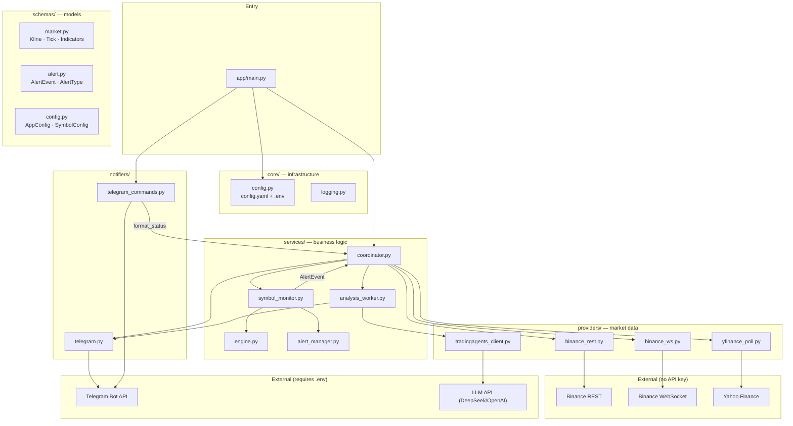
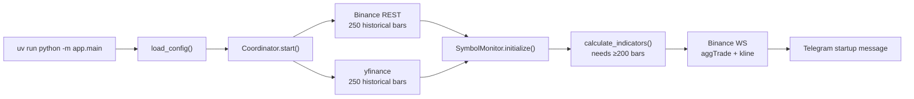
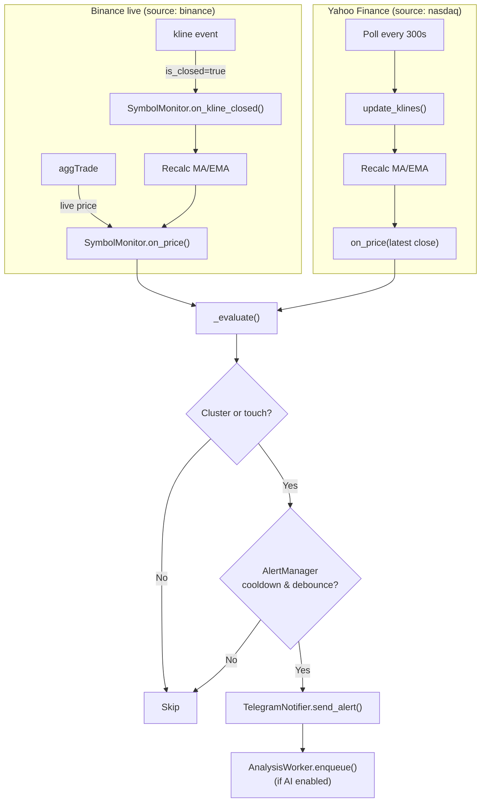
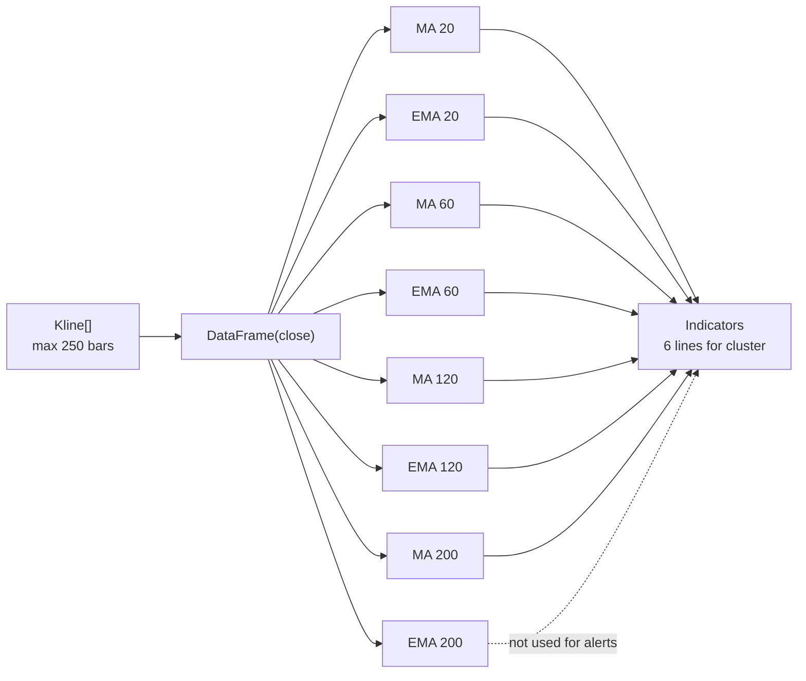
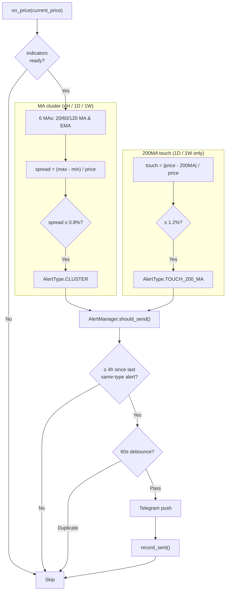
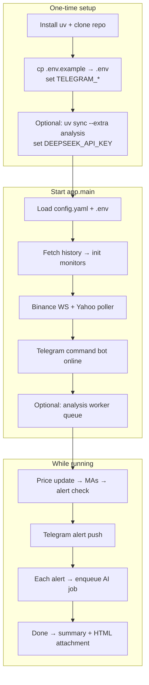
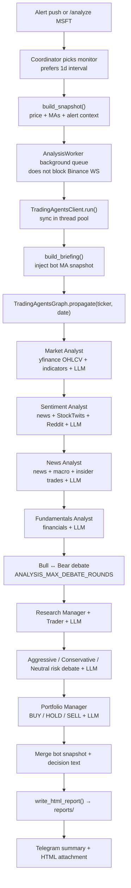

# Invest Alert Bot Demo version

**Author:** [Shijie Zheng (Kerry Zheng)](https://github.com/Formyselfonly) · **Official repo:** [github.com/Formyselfonly/invest-alert-bot](https://github.com/Formyselfonly/invest-alert-bot)

> This is the **canonical open-source repository**. Forks and re-uploads should link here and retain [LICENSE](./LICENSE) + [NOTICE](./NOTICE).

A Python asyncio market monitor and alert system focused on **MA cluster density** and **200MA touch** detection. When conditions are met, it pushes instant Telegram notifications to support trading decisions.

**Since v0.2**, optional integration with [TradingAgents](https://github.com/TauricResearch/TradingAgents): rule-based MAs decide **when** to alert; multi-agent LLM analysis helps interpret **what it might mean** after each alert.

> Current version: **v0.2** — hybrid data sources + Telegram alerts + optional TradingAgents AI analysis

**Languages:** English (this file) · [中文 readme](./readme.zh-CN.md)

🌐 **Live showcase (static, no server):** [formyselfonly.github.io/invest-alert-bot](https://formyselfonly.github.io/invest-alert-bot/) · **[MA Dashboard →](./docs/dashboard.html)** · Custom domain: [invest.kerryzhengai.com](https://invest.kerryzhengai.com)

---

## Screenshots

**Telegram — alerts, `/status`, and AI report delivery**


**TradingAgents AI deep-dive report (HTML)**


**Live demo site:** [docs/index.html](./docs/index.html) — static showcase (GitHub Pages ready). See [Showcase deployment](#showcase-deployment-github-pages) below.

---

## Attribution & content reuse

Use this block when citing the project (README, Bilibili, Xiaohongshu, portfolio, slides):

```
Invest Alert Bot — open-source fintech MA monitor & Telegram alerts
Author: Shijie Zheng (Kerry Zheng)
https://github.com/Formyselfonly/invest-alert-bot
Live demo: https://formyselfonly.github.io/invest-alert-bot/
License: Apache-2.0
```

**Not financial advice.** Demo / learning project only.

### Scope of use (author policy)

This project is released under **Apache-2.0**. The author’s expectations for the community (see [NOTICE](./NOTICE)):

| ✅ Allowed (no extra permission) | ⚠️ Contact author first | ❌ Not allowed |
|----------------------------------|-------------------------|----------------|
| Study, research, read source code | Commercial use or monetization | Remove copyright / LICENSE / NOTICE |
| Personal non-commercial deploy | Public forks or paid derivative products | Claim as your original work |
| Cite with attribution + link to official repo | Rebranded or rewritten public releases | Impersonate the official project |

> **Do not rewrite and publish or monetize without permission.** For commercial use, secondary development, or public forks, open a [GitHub Issue](https://github.com/Formyselfonly/invest-alert-bot/issues) and obtain written consent from **Shijie Zheng (Kerry Zheng)**.  
> Legally, [Apache-2.0](./LICENSE) applies; the table above states the author’s citation and compliance expectations.

---

The author does not trade live with this system or work in the finance industry. This is a paper-trading / portfolio project for learning only. **Not financial advice.**

---

## Core Philosophy

1. **Value investing** — watch meaningful assets only
2. **Buy the dip** — no entry until price reaches a “bargain” zone; with enough symbols, something will eventually qualify
3. **Survival first** — not losing is winning
4. **Trust the MAs, not headlines** — moving averages reflect where real money has settled

---

## Features

| Feature | Description | Status |
|---------|-------------|--------|
| **MA cluster alerts** | 20/60/120 MA & EMA (6 lines), **4H / 1D / 1W**, spread ≤ 0.8% | ✅ |
| **200MA touch alerts** | **1D / 1W only**, **200MA only** (not 200EMA), distance ≤ 1.2% | ✅ |
| **Telegram commands** | `/status`, `/status BTC`, `/clear`, etc. | ✅ |
| **Binance futures** | Crypto (BTC, ETH, …) via WebSocket | ✅ |
| **Nasdaq / Yahoo** | US equities & gold (GC=F) — historical bars + polled price | ✅ |
| **Telegram push** | Touch-triggered, cooldown + debounce | ✅ |
| **Dynamic config** | Watchlist in `config.yaml` | ✅ |
| **AI deep-dive** | Auto TradingAgents analysis after alerts (optional) | ✅ |
| **Database** | None (v1 in-memory; cooldown resets on restart) | — |

---

## Monitoring Rules

Each symbol is monitored independently on **3 timeframes**. Alerts cooldown per `symbol + interval + type`.

**Example: BTC/USDT**

| Check | 4H | 1D | 1W |
|-------|----|----|-----|
| MA cluster (6-line spread ≤ 0.8%) | ✅ | ✅ | ✅ |
| 200MA touch (≤ 1.2% from 200MA) | — | ✅ | ✅ |

> **No 200MA touch on 4H.** **200EMA is not used** for touch alerts.

**13 symbols** today (see `config.yaml`): 5 crypto + 8 US equities/ETFs/gold.

Each interval needs **≥200 closed bars** at startup; otherwise that monitor is skipped (e.g. HYPE 1W, CRCL 1W). Typically **~37/39** monitors are active.

---

## Tech Stack

| Layer | Technology |
|-------|------------|
| Language | Python 3.12+ |
| Package manager | [uv](https://docs.astral.sh/uv/) |
| Market data | Binance USDT-M futures (crypto) + Yahoo Finance (equities/gold) |
| Indicators | Pandas |
| Alerts | Telegram Bot API |
| Runtime | Asyncio |
| Deploy | Docker + systemd |

---

## Project Structure

```
invest-alert-bot/
├── app/
│   ├── main.py                 # Entry point
│   ├── core/                   # Config, logging
│   ├── schemas/                # Pydantic models
│   ├── providers/              # Binance WS/REST, yfinance, TradingAgents
│   ├── services/               # Engine, alerts, coordinator, analysis worker
│   └── notifiers/              # Telegram push & commands
├── tests/
├── config.yaml                 # Watchlist & thresholds
├── .env.example                # Telegram & AI keys template
├── Dockerfile
├── prd.md
├── plan.md
└── README.md
```

---

## Architecture

### Code layout

Single-process asyncio app: `providers` fetch data, `services` compute & orchestrate, `notifiers` talk to Telegram.



| Layer | Directory | Role |
|-------|-----------|------|
| Entry | `main.py` | Start coordinator + Telegram command bot; handle SIGINT/SIGTERM |
| Orchestration | `coordinator.py` | Init monitors, wire data sources, route tick/kline updates |
| Monitor | `symbol_monitor.py` | Per `symbol × interval`: bars, indicators, live price |
| Engine | `engine.py` | Pandas MA/EMA; cluster & touch detection |
| Alerts | `alert_manager.py` | 4h cooldown + 60s debounce per `(symbol, interval, type)` |
| Market data | `providers/` | Binance REST/WS, Yahoo polling |
| Analysis | `analysis_worker.py` | Async queue → TradingAgents → Telegram summary + HTML |
| Notify | `notifiers/` | Telegram alerts & commands |

---

### Data flow

#### Bootstrap



#### Runtime



#### Data sources

| Config `source` | History | Live price | Notes |
|-----------------|---------|------------|-------|
| `binance` + `market: futures` | Binance futures REST | Binance futures WS | Crypto, e.g. `BTC/USDT` |
| `nasdaq` | Yahoo Finance | Polled close | US tickers like `MSFT`; gold `XAU` + `ticker: GC=F` |
| `yfinance` | Same as nasdaq | Same as nasdaq | Alias for `nasdaq` |

> Intervals with fewer than 200 bars are skipped at startup (see logs).

---

### Algorithm

#### Indicators

Computed from **closed** bar closes (Pandas rolling/EWM). Requires at least 200 bars.



#### Alert evaluation (on every price update)

Live price from Binance tick or Yahoo poll; MAs from closed bars — **touch does not wait for bar close**.



#### Formulas

**MA cluster** (6 lines: 20/60/120 MA + EMA):

```
spread = (max(6 MAs) - min(6 MAs)) / current_price
Trigger: spread ≤ thresholds.cluster (default 0.8%)
```

**200MA touch** (1D / 1W only; not 4H; not 200EMA):

```
touch = abs(current_price - 200MA) / current_price
Trigger: touch ≤ thresholds.touch (default 1.2%)
```

| Design choice | Detail |
|---------------|--------|
| Touch on live price | No need to wait for bar close |
| MAs from closed bars | Current incomplete bar excluded |
| Cooldown | Default 4 hours per `(symbol, interval, alert_type)` |
| Debounce | No duplicate send within 60s for same key |
| In-memory state | No DB; cooldown resets on restart |

See [prd.md](./prd.md) for full specs and acceptance criteria.

---

## End-to-end: Install → Run → Verify

This is a **single-process bot** (not a web API): one command runs **market monitoring + Telegram commands + (optional) AI analysis**.

### Overview



### Step 1: Install dependencies

```bash
cd invest-alert-bot

# Core (monitoring + alerts — required)
uv sync

# AI analysis (TradingAgents + DeepSeek) — optional
uv sync --extra analysis
```

> **`uv sync` alone is enough** for monitoring and alerts. Without `--extra analysis`, AI is disabled and the startup message will say so.

### Step 2: Configure environment

```bash
cp .env.example .env
```

**Minimum (alerts only):**

```env
TELEGRAM_BOT_TOKEN=your_botfather_token
TELEGRAM_CHAT_ID=your_numeric_chat_id
```

**For AI analysis**, also set:

```env
ANALYSIS_ENABLED=true
LLM_PROVIDER=deepseek
DEEPSEEK_API_KEY=your_deepseek_key
```

DeepSeek base URL is built into TradingAgents (`https://api.deepseek.com`). Watchlist and thresholds live in `config.yaml`.

### Step 3: Run

```bash
uv run python -m app.main
```

**Success indicators:**

1. No errors in terminal; logs like:
   - `Coordinator started with XX monitors`
   - `Binance futures WS started`
   - `Equity poller started: MSFT ...`
   - `Analysis worker started` (if AI enabled)
2. Telegram startup message with monitor count and `🧠 AI analysis: enabled (deepseek)` (or disabled / not installed)
3. `/start` or `/status` returns a reply

Press `Ctrl+C` to stop.

### Step 4: Verification checklist

| # | Check | Command / action | Expected |
|---|-------|------------------|----------|
| 1 | Unit tests | `uv run pytest tests/ -v` | All PASS |
| 2 | Lint | `uv run ruff check app tests` | No errors |
| 3 | Telegram | `uv run python -m app.scripts.test_telegram` | Test message received |
| 4 | Bot online | Send `/status` | Full watchlist status |
| 5 | Single symbol | `/status MSFT` | MSFT per-interval cluster / 200MA |
| 6 | AI package | `uv run python -c "import tradingagents; print('ok')"` | Prints `ok` (skip if no AI) |
| 7 | Manual AI | `/analyze MSFT` | “Queued…” → summary + HTML in ~5–20 min |
| 8 | Alert → AI | Wait for real alert or watch logs | Alert push → auto AI queue (if enabled) |

**Logs:** `logs/app.log` (configure in `config.yaml` → `logging`)

**AI reports:** `reports/report_*.html` (also sent as Telegram attachments)

### Troubleshooting

| Symptom | Cause | Fix |
|---------|-------|-----|
| `TELEGRAM_* missing` on start | Empty `.env` | Fill per `.env.example` |
| AI shows “not installed” | Missing `--extra analysis` | Run `uv sync --extra analysis`, restart |
| AI shows “disabled” | `ANALYSIS_ENABLED=false` | Set `true` + `DEEPSEEK_API_KEY` |
| `nan%` in `/status` | Incomplete Yahoo bars | Update code & restart (fixed in current version) |
| Some intervals skipped | &lt;200 bars | Check startup log `Skip monitor` — expected for new listings |

---

## Quick Start

### Create a Telegram bot (one-time)

You need a **Bot Token** and **Chat ID**.

#### 1. BotFather

1. Open [@BotFather](https://t.me/BotFather) in Telegram
2. Send `/newbot`
3. Choose a display name, e.g. `Invest Alert Bot`
4. Choose a username ending in `bot`, e.g. `my_invest_alert_bot`
5. Copy the **token** → `TELEGRAM_BOT_TOKEN`

#### 2. Chat ID

**Option A (recommended):**

```bash
uv run python -m app.scripts.get_chat_id
```

Send your bot a message when prompted; the script prints `TELEGRAM_CHAT_ID`.

**Option B:** [@userinfobot](https://t.me/userinfobot) → copy numeric **Id**

**Option C:** Browser `getUpdates`

1. Message your bot (`/start`)
2. Visit `https://api.telegram.org/bot<TOKEN>/getUpdates`
3. Find `"chat":{"id":123456789}`

> Empty `"result":[]`? Message the correct bot, or call `deleteWebhook` first.

#### 3. Write `.env`

```bash
cp .env.example .env
```

```env
TELEGRAM_BOT_TOKEN=7123456789:AAHxxxxxxxxxxxxxxxxxxxxxxxxxxxxxxxxx
TELEGRAM_CHAT_ID=123456789
```

---

### Install & configure

```bash
# Install uv if needed
curl -LsSf https://astral.sh/uv/install.sh | sh

git clone https://github.com/Formyselfonly/invest-alert-bot.git
cd invest-alert-bot

uv sync
# uv sync --extra analysis   # if you want AI
```

Edit `config.yaml`:

```yaml
symbols:
  # Crypto — Binance futures
  - symbol: BTC/USDT
    source: binance
    market: futures
    intervals: [4h, 1d, 1wk]

  # US equity — Yahoo Finance
  - symbol: MSFT
    source: nasdaq
    intervals: [4h, 1d, 1wk]

  # Gold — COMEX futures
  - symbol: XAU
    source: nasdaq
    ticker: GC=F
    intervals: [4h, 1d, 1wk]

thresholds:
  cluster: 0.008   # 0.8% cluster width
  touch: 0.012     # 1.2% from 200MA
```

---

## How to run (no FastAPI)

This project is **not a web API**. One command keeps the bot alive:

```bash
uv run python -m app.main
```

Process running = bot online. Close the terminal = bot offline.

Telegram-only smoke test (no full monitor): `uv run python -m app.scripts.test_telegram`

---

### Telegram commands

| Command | Action |
|---------|--------|
| `/start` | Welcome & menu |
| `/status` | All symbols × intervals |
| `/status BTC` | Single symbol |
| `/analyze MSFT` | Manual AI analysis (requires AI enabled) |
| `/clear` | Clear chat (does not reset alerts) |
| `/help` | Help |

**Alert titles:** `📊 MA cluster — entry opportunity` / `🎯 200MA touch — dip opportunity`

**After alerts** (if AI enabled): auto `🧠 Analysis queued…` → summary + HTML attachment.

---

### Tests

```bash
uv run pytest tests/ -v
uv run ruff check app tests
```

---

## Sample alert

```
📊 Invest Alert Bot
━━━━━━━━━━━━━━━
Alert: MA cluster
Asset: BTC/USDT
Interval: 4H
Price: $67,432.5000
Detail: Cluster width 0.62% (threshold 0.8%)
Time: 2026-06-16 14:32:08 UTC
```

---

## Configuration reference

| Setting | File | Description |
|---------|------|-------------|
| `TELEGRAM_BOT_TOKEN` | `.env` | From BotFather |
| `TELEGRAM_CHAT_ID` | `.env` | Your Telegram user ID |
| `ANALYSIS_ENABLED` | `.env` | Enable TradingAgents queue |
| `LLM_PROVIDER` | `.env` | e.g. `deepseek`, `openai` |
| `symbols` | `config.yaml` | Watchlist |
| `thresholds.cluster` | `config.yaml` | Default `0.008` (0.8%) |
| `thresholds.touch` | `config.yaml` | Default `0.012` (1.2%) |
| `alert.cooldown_seconds` | `config.yaml` | Default `14400` (4 hours) |

---

## Private custom edition (VIP)

The open-source repo is free forever (Apache-2.0). For **author-managed deployment, ops, and personalization**:

| Tier | Price | Active users | Capacity | Best for |
|------|-------|--------------|----------|----------|
| **VIP Custom** | **$20 / month** | **16** | **50** | Individual traders — dedicated bot, custom watchlist/thresholds, VPS ops |
| **Premium VIP** | **$50 / month** | **3** | **10** | Power users — all VIP perks + AI analysis + private dashboard + 24h support |

Separate capacity pools (**16/50** VIP, **3/10** Premium VIP — not shared).

### Privacy & strategy confidentiality

Private custom means **your trading approach is never published or leaked**:

- **Dedicated instance** — separate bot & config; alerts only to your Telegram
- **Strategy confidentiality** — watchlist, intervals & thresholds are not shared or used in marketing
- **Isolated from public demo** — GitHub Pages shows default demo only; VIP configs never appear on the site
- **Credential isolation** — `.env` / API keys never committed to public repos

You pay for deployment, ops, personalization & support — not the source code. See [index.html#premium](./docs/index.html#premium) or [live preview](https://formyselfonly.github.io/invest-alert-bot/#premium).

Apply via [GitHub Issues](https://github.com/Formyselfonly/invest-alert-bot/issues/new) with title `VIP Custom` or `Premium VIP Custom`.

---

## Showcase & dashboard (GitHub Pages)

Static site — **no Python bot server**. GitHub Actions exports live MA data every **5 minutes** (same as equity poll interval in `config.yaml`).

| Page | URL |
|------|-----|
| **MA Dashboard** | [/dashboard.html](https://formyselfonly.github.io/invest-alert-bot/dashboard.html) |
| Project intro | [/index.html](https://formyselfonly.github.io/invest-alert-bot/) |
| Custom domain | [invest.kerryzhengai.com](https://invest.kerryzhengai.com) (after DNS setup) |

### Update frequency

| Source | Bot (local) | Web dashboard |
|--------|-------------|---------------|
| Crypto (Binance) | WebSocket real-time | Snapshot every **5 min** (GitHub Actions cron) |
| Equities (Yahoo) | Poll every **300s** | Same **5 min** export |

### One-time setup

1. Push repo (includes `docs/`, `.github/workflows/deploy-pages.yml`).
2. **Settings → Pages → Source → GitHub Actions**.
3. **Actions → Deploy Showcase → Run workflow** (or push to `main`).
4. Open dashboard URL above.

### Custom domain `invest.kerryzhengai.com`

1. Repo already includes `docs/CNAME` → `invest.kerryzhengai.com`.
2. At your DNS provider (kerryzhengai.com), add:

   | Type | Name | Value |
   |------|------|-------|
   | **CNAME** | `invest` | `formyselfonly.github.io` |

3. GitHub **Settings → Pages → Custom domain** → enter `invest.kerryzhengai.com` → Save.
4. Enable **Enforce HTTPS** when available.

Codex / visitors read **`docs/data/status.json`** (generated on each deploy) or the dashboard table.

### Local export & preview

```bash
# Generate status.json locally
uv run python -m app.scripts.export_dashboard

# Preview site (dashboard needs status.json)
python -m http.server 8080 --directory docs
# http://localhost:8080/dashboard.html
```

### Troubleshooting

| Issue | Fix |
|-------|-----|
| Dashboard empty | Run export script or wait for Actions deploy |
| Pages 404 | Source = **GitHub Actions**; wait for green workflow |
| Domain not working | DNS CNAME → `formyselfonly.github.io`; wait up to 24h |

> **Bot vs website:** Pages only serves static HTML + JSON. Telegram bot runs separately on your machine/VM.

---

## Docker

```bash
docker build -t invest-alert-bot .
docker run -d \
  --name invest-alert-bot \
  --restart always \
  --env-file .env \
  -v $(pwd)/config.yaml:/app/config.yaml \
  -v $(pwd)/logs:/app/logs \
  invest-alert-bot
```

Best on an **always-on VM** (AWS EC2 / Lightsail). Not suited to serverless.

---

## Relationship to TradingAgents

This repo is a **downstream integration** of [TradingAgents](https://github.com/TauricResearch/TradingAgents) — not a fork of the upstream project.

| | TradingAgents (upstream) | Invest Alert Bot (this repo) |
|---|--------------------------|------------------------------|
| Role | Multi-agent LLM financial research framework | 24/7 MA monitor + Telegram alert bot |
| Trigger | CLI / manual `propagate(ticker, date)` | **Auto-queue on every alert** + `/analyze` |
| Latency | Minutes | Alerts in seconds; AI async 5–20 min |
| Core logic | Fundamentals, sentiment, news, debate | **Rule-based MAs** (cluster + 200MA) |
| Install | `pip install tradingagents` | `uv sync --extra analysis` |

### Where TradingAgents runs in this project

**Division of labor:** the bot answers “when to look” (second-level rule alerts); TradingAgents answers “how to read it / is it worth acting on” (multi-agent research over minutes). Moving averages remain the **only automatic alert source** — AI does not change thresholds or place orders.

#### End-to-end flow



#### What the result depends on

| Source | Content | Determinism |
|--------|---------|-------------|
| **Invest Alert Bot** | Price, MA20/60/120/200, cluster width, 200MA distance, alert type | High (live kline math) |
| **TradingAgents / yfinance** | OHLCV, MACD/RSI, fundamentals, news | Medium (external API) |
| **TradingAgents / StockTwits** | Retail Bullish/Bearish sentiment | Medium |
| **TradingAgents / Reddit** | r/wallstreetbets, r/stocks, r/investing posts | Low (often 403-blocked; degrades gracefully) |
| **DeepSeek / OpenAI LLM** | Debate, synthesis, final stance | Low (non-deterministic) |

#### Why it takes so long

TradingAgents runs **4 analysts + bull/bear debate + trader + three-way risk debate + portfolio manager** in sequence. Each step waits on data fetches and LLM calls (often 10–60s each). A full run is typically **5–20 minutes**. Default timeout: `ANALYSIS_TIMEOUT_SECONDS=1800` (30 minutes).

Reddit 403 errors come from TradingAgents’ built-in sentiment data source being blocked — analysis **continues with degraded social data** and is unrelated to timeout failures.

- Wrapper: `app/providers/tradingagents_client.py`
- Design doc: [tradingagents-iteration.md](./tradingagents-iteration.md)
- Default LLM: `LLM_PROVIDER=deepseek` (OpenAI and other upstream providers also work)

### Citing TradingAgents

```bibtex
@misc{xiao2025tradingagentsmultiagentsllmfinancial,
      title={TradingAgents: Multi-Agents LLM Financial Trading Framework},
      author={Yijia Xiao and Edward Sun and Di Luo and Wei Wang},
      year={2025},
      eprint={2412.20138},
      archivePrefix={arXiv},
      primaryClass={q-fin.TR},
      url={https://arxiv.org/abs/2412.20138},
}
```

### Getting visibility with the upstream project

| Approach | Action |
|----------|--------|
| **README + Star** | Keep this section; star [TradingAgents](https://github.com/TauricResearch/TradingAgents) |
| **Showcase Issue** | Open an issue on upstream with repo link & architecture — good for community discovery |
| **Docs PR** | Propose a “Community Projects” line or minimal `examples/` snippet upstream |
| **Discord** | Share in upstream Discord showcase channel |

---

## Enable AI analysis (TradingAgents)

> **Important:** Monitoring and alerts work **without** AI dependencies. Only the deep-dive analysis is skipped.

### 1. Optional dependency

```bash
uv sync --extra analysis
```

### 2. `.env`

```env
ANALYSIS_ENABLED=true
LLM_PROVIDER=deepseek
DEEPSEEK_API_KEY=your_key
```

DeepSeek uses OpenAI-compatible API (endpoint built into TradingAgents). For OpenAI: `LLM_PROVIDER=openai` + `OPENAI_API_KEY`.

Optional tuning:

```env
ANALYSIS_ANALYSTS=market,news,fundamentals  # comma-separated; default omits social
ANALYSIS_MAX_DEBATE_ROUNDS=1        # debate rounds; higher = slower
ANALYSIS_TIMEOUT_SECONDS=1800       # per-run timeout (seconds); default 30 min
```

### 3. Behavior

| Event | Behavior |
|-------|----------|
| **After any alert** | Auto-queue TradingAgents analysis (~5–20 min) |
| Analysis starts | Telegram: “Analysis queued…” |
| Analysis done | **Summary message** + **HTML report attachment** |
| `/analyze MSFT` | Manual trigger (no alert required) |

Reports are saved under `reports/` and attached in Telegram.

Startup message shows: `🧠 AI analysis: enabled (deepseek)` or `disabled` / `not installed`.

### 4. How to read the analysis output

#### What’s in the HTML report

After analysis completes, Telegram sends a **summary message** plus an **HTML attachment**. Typical sections:

| Section | Content |
|---------|---------|
| **Bot snapshot** | Price, MAs, cluster width, 200MA distance (ground truth — AI must not invent prices) |
| **Overall rating** | Final label, e.g. `Hold` |
| **Portfolio Manager decision** | Full write-up (Executive Summary, stop/add conditions, etc.) |
| **Market analysis** | TradingAgents technical view (MACD, RSI, MAs, …) |
| **News & macro** | Ticker news + Fed / macro headlines |
| **Fundamentals** | Financials, valuation, cash flow (stocks / ETFs) |
| **Trader plan** | Trading stance summary |
| **Bull/Bear debate & risk review** | Debate conclusions |

The Telegram summary prefers the **Executive Summary**; use the HTML attachment for the full report.

#### What the final rating means (Buy / Hold / Sell…)

After all analysts, debate, and risk review, the **Portfolio Manager** outputs a **5-tier rating** (most bullish → most bearish):

| Rating | Meaning (research view — not a trade order) |
|--------|---------------------------------------------|
| **Buy** | Strong bullish — add / open position |
| **Overweight** | Bullish — above benchmark weight |
| **Hold** | **Neutral — maintain status quo**; no add, no cut; wait and watch |
| **Underweight** | Bearish — below benchmark weight |
| **Sell** | Strong bearish — reduce / exit |

**`Hold` does not mean “no analysis” or “analysis failed”.** It means the AI sees offsetting bull/bear factors: **not worth buying actively, not worth selling actively** — keep current exposure.

Example (MSFT far below 200MA): decent fundamentals + weak technicals → often `Hold` (stay at benchmark weight; consider adds only after a confirmed reclaim of key levels).

#### How this relates to Bot MA alerts

| Layer | Says what |
|-------|-----------|
| **Bot alert** | “Price hit a rule level — time to look” — **rule trigger** (seconds) |
| **AI rating** | “After review, is it worth acting?” — **research conclusion** (minutes) |

Division of labor:

- Bot cluster / 200MA rules remain the **only automatic alert source**
- AI does **not** change alert thresholds and does **not** place orders
- `Hold` means: the alert is worth attention, but AI does not support adding or cutting right now

> Disclaimer: AI output is for research only, not investment advice. You may compare it with your MA strategy; `Hold` is not a hard ban on trading.

Details: [tradingagents-iteration.md](./tradingagents-iteration.md).

---

## Documentation

| Doc | Description |
|-----|-------------|
| [readme.zh-CN.md](./readme.zh-CN.md) | Chinese README |
| [prd.md](./prd.md) | Product requirements & acceptance |
| [plan.md](./plan.md) | Development plan |
| [tradingagents-iteration.md](./tradingagents-iteration.md) | TradingAgents integration design |
| [TradingAgents upstream](https://github.com/TauricResearch/TradingAgents) | Official multi-agent framework |

---

## License

Licensed under the **[Apache License 2.0](./LICENSE)**. See also [NOTICE](./NOTICE).

### Apache-2.0 compliance

**If you use, fork, or redistribute this project**, you must:

1. Keep the **copyright notice** and a copy of the **License**
2. **Link back** to this repository: https://github.com/Formyselfonly/invest-alert-bot
3. State **what you changed** in modified files (Apache 2.0 §4)

Removing author attribution or republishing as your own original work **violates the license**.

### Author usage policy (supplement)

Beyond Apache-2.0, see [NOTICE](./NOTICE) and [Scope of use](#scope-of-use-author-policy) above:

- **OK:** learning, personal non-commercial deployment, attributed citations  
- **Ask first:** profit, public derivative releases, rewritten services for others  
- **Not OK:** strip attribution, remove LICENSE, pass off as official/original work  

For commercial licensing or derivative work approval, contact the author via GitHub.

**Author:** [Shijie Zheng (Kerry Zheng)](https://github.com/Formyselfonly) · Bilibili: 郑同学是我
