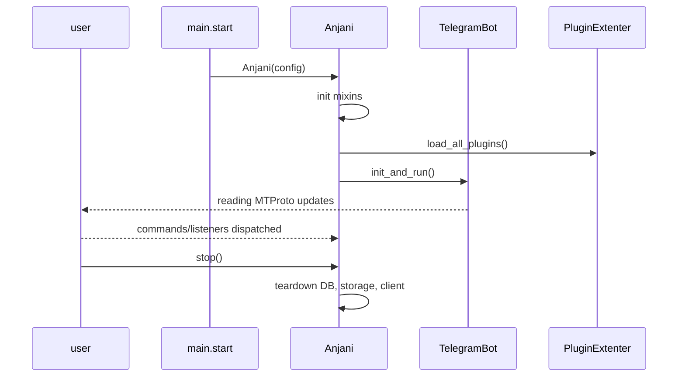

# Bot Lifecycle & Core Mixins

How the Anjani bot starts, runs, and stops.

## Entry point
- `anjani/main.py::start()` is the console entry point (`anjani = "anjani.main:start"`).
- `anjani/core/anjani_bot.py::class Anjani(TelegramBot, DatabaseProvider, PluginExtenter, CommandDispatcher, EventDispatcher)` is the composed bot.
- `Anjani.__init__(self, config)` builds the object; `init_and_run()` starts the runtime; `stop()` tears down.

## TelegramBot mixin
`core/telegram_bot.py` owns the Pyrogram/Pyrofork client and the MTProto connection. It provides the `.client` surface plugins use to call Telegram APIs (`send_message`, `ban_chat_member`, etc.).

## DatabaseProvider mixin
`core/database_provider.py` wraps the **MongoDB** connection and database handles used for domain data (users, chats, settings, notes, federations, etc.).

## SQLiteStorage
`core/sqlite_storage.py` is a Pyrogram **Storage** backend persisted to SQLite:
- Session/auth data: `dc_id`, `api_id`, `test_mode`, `auth_key`, `date`, `user_id`, `is_bot`, `version`.
- Peer cache API: `update_peers`, `update_usernames`, `get_peer_by_id`, `get_peer_by_username`, `get_peer_by_phone_number`.
- Session methods: `open`, `save`, `close`, `delete`, `create`, `update`, `update_state`.

## Lifecycle flow

## Invariants
- One composed `Anjani` object per process.
- Plugins are loaded after init and before `init_and_run`.
- Storage and DB are torn down on `stop`.
