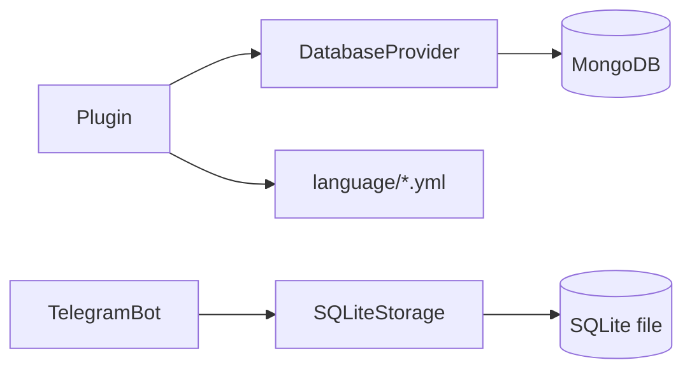

# Storage

Anjani uses two data stores with distinct responsibilities.

## MongoDB — domain data (via DatabaseProvider)
- **Purpose:** users, chats, settings, notes, federations, ban lists, per-group config.
- **Access:** through the `DatabaseProvider` mixin (`core/database_provider.py`), which wraps the Mongo client and exposes database/collection handles to plugins.
- All operations are async.

## SQLite — Pyrogram session & peer storage (SQLiteStorage)
- **Purpose:** the MTProto client's persisted session (auth key, API ids, datacenter), plus a peer/username cache used for entity resolution.
- **File:** `core/sqlite_storage.py`, implements Pyrogram's `Storage` interface.
- Session fields: `dc_id`, `api_id`, `test_mode`, `auth_key`, `date`, `user_id`, `is_bot`, `version`.
- Peer methods: `update_peers`, `update_usernames`, `get_peer_by_id`, `get_peer_by_username`, `get_peer_by_phone_number`.
- Lifecycle: `open` / `save` / `close` / `delete` / `create` / `update`.

## Decision rules
- If the data is per-user/per-chat **domain state** → MongoDB.
- If it's **client session** or **entity resolution** → SQLiteStorage.
- If it's **localization** → `language/*.yml`, not a DB (see practices).

