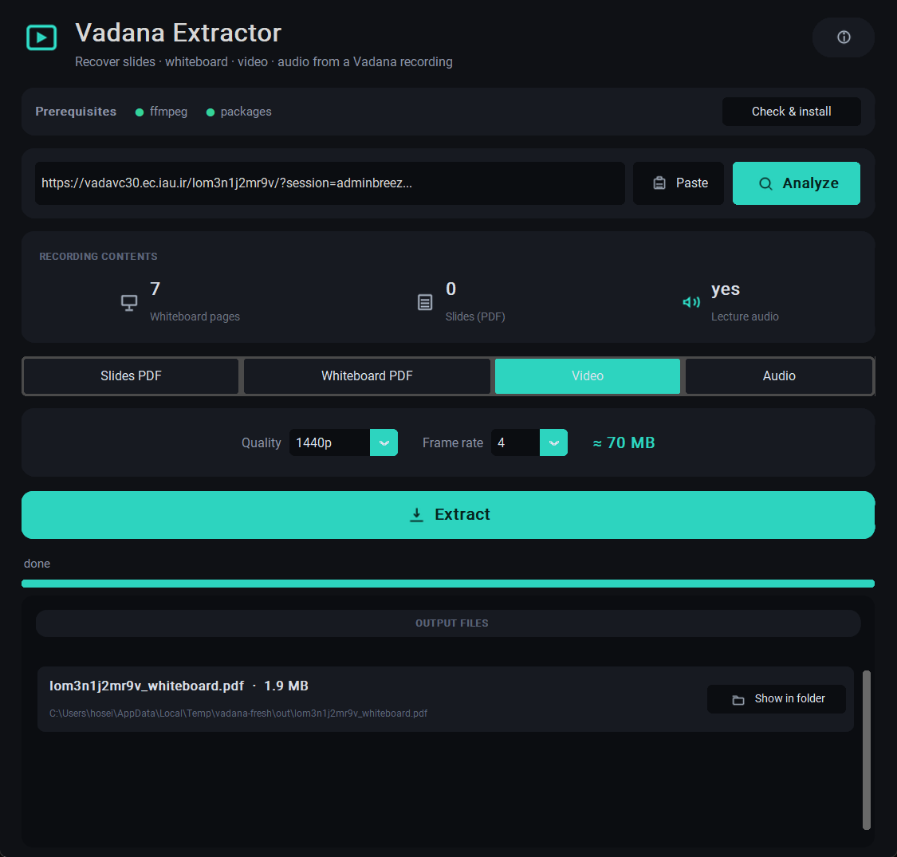
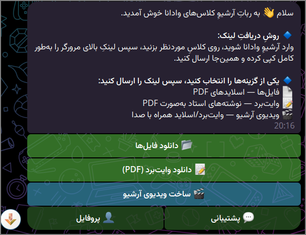
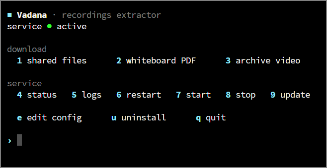

<div align="center">

**Recover slides, whiteboard & a synced video from any Adobe Connect recording — IAU "Vadana" included.**

<br />

[](https://github.com/phoseinq/vadana-extractor/actions/workflows/ci.yml)
[](https://github.com/phoseinq/vadana-extractor/releases)
[](https://python.org)
[](https://t.me/iau_archive_Bot)
[](LICENSE)

<br />

**English** · [فارسی](README.fa.md)

[▶️ Try the live bot](https://t.me/iau_archive_Bot) · [Report a bug](https://github.com/phoseinq/vadana-extractor/issues) · [Request a feature](https://github.com/phoseinq/vadana-extractor/issues)

</div>

<br />

<div align="center">



<sub><b>Desktop app</b> — analyze a recording, choose an output, extract</sub>

<br />
<br />

<table>
<tr>
<td align="center"><br /><sub><b>Telegram bot</b></sub></td>
<td align="center"><br /><sub><b>Interactive CLI</b></sub></td>
</tr>
</table>

</div>

<br />

## ✨ What you get

Study material pulled straight out of a recording's own offline package — no screen-recording, no re-uploads. Built for IAU's **Vadana** servers (every branch — `vadavc30`, `vadana14`, `vadana36`, …), but the package layout is standard Adobe Connect, so **any host works**: just paste the full recording link.

- 📄 **Shared files** — the original PDF slides from the Share pod, even when the download button was off.
- 📝 **Whiteboard → PDF** — every board page as a clean PDF, strokes smoothed. Drawings over a shared PDF keep that page behind the annotations.
- 🎬 **Synced video** — whiteboard + screen-share + audio on one timeline.
- 🎧 **Audio only** — visual-less sessions come back as `m4a` or `mp3`.
- 🖼️ **Preview + details** — each file arrives with a thumbnail and a short caption (id, date, size, length).
- 🤖 **Three ways to run** — a Telegram bot, an interactive CLI, and a dark desktop GUI.
- 🇮🇷 **Runs anywhere** — locally or on an Iran server with no proxy; a reverse proxy only when hosted abroad.

**One recording link, three possible outputs:**

| You send | You get back |
| :-- | :-- |
| a link + 📄 **files** | the original slide PDFs (`Chapter 1.pdf`, `notes.docx`, …) |
| a link + 📝 **whiteboard** | one PDF of the board — the professor's notes laid over the slides |
| a link + 🎬 **video** | an MP4: whiteboard + screen-share + audio, page-synced |

<br />

## ⚡ Quick start — interactive CLI

**Prerequisites:** Python **3.11–3.13** (tick *Add to PATH*) · `ffmpeg` for video/audio (`winget install ffmpeg`).

```bash
git clone https://github.com/phoseinq/vadana-extractor
cd vadana-extractor
pip install -r requirements.txt
python cli/vadana.py          # Windows: just double-click vadana.bat
```

Fully guided: paste the recording link, it tells you what the recording actually contains (whiteboard / slides / audio), then you pick from a menu — **slides PDF**, **whiteboard PDF**, **synced video**, or **audio only (m4a / mp3)**. It loops, so you can grab several outputs — or several recordings — without re-running. Everything lands in `out/`.

> The plain link is usually enough. If a recording asks you to log in, copy the full link including its `session=` value (it expires fast).

<details><summary><b>Prefer one-shot commands?</b></summary>

<br />

```bash
python cli/download_slides.py "https://<connect-host>/<id>/"   # shared files
python cli/make_video.py "<url>"                               # synced video (audio-only -> .m4a)
python cli/make_video.py "<url>" --pages-only                  # board pages as a PDF
```
</details>

<br />

## 🖥️ Desktop app (dark GUI)

Prefer a window over a terminal? On **Windows** double-click **`vadana-gui.bat`** (it installs the one GUI dependency the first time and opens the app); on any OS:

```bash
pip install -r requirements-gui.txt
python gui/vadana_gui.py
```

Paste the link (there's a **Paste** button, so it works on any keyboard layout), hit **Analyze**, and it shows what the recording holds. Then pick **Slides PDF / Whiteboard PDF / Video / Audio**, choose the video **quality** (720p / 1080p / 1440p / 4K) and **frame rate**, or the audio **format** (m4a / mp3), and **Extract** — with a live **size estimate** as you tweak.

Dark theme with line icons, a **prerequisites** check that one-click installs what's missing (ffmpeg + packages), a **Cancel** button, **retry on error**, an **output-files** box (name, size, path, *reveal in folder*), live progress, an on-screen + file log (`out/vadana.log`), and an **About** dialog. Everything is saved to `out/`.

<br />

## 🤖 Bot setup

One command on the server. It asks Docker or native, installs everything (ffmpeg, the dependencies, the systemd service, the `vadana` command), then prints the next step.

```bash
curl -fsSL https://raw.githubusercontent.com/phoseinq/vadana-extractor/main/install.sh | bash
```

> **Docker** runs the published image `ghcr.io/phoseinq/vadana-extractor:latest` (CI pushes it on every release), so a Docker install — and `docker compose pull` — needs no local build; `build:` stays as a fallback.

Then fill in `bot/.env` (run `vadana env`, or edit it for Docker) and start:

| Variable | Meaning |
| :-- | :-- |
| `BOT_TOKEN` | token from [@BotFather](https://t.me/BotFather) — **required** |
| `IRAN_PROXY` | HTTP/SOCKS5 proxy, only when hosting abroad; empty otherwise |
| `ADMINS` | comma-separated user ids allowed to build videos |
| `STORAGE_CHANNEL` | private channel id used as a file cache (bot must be admin) |
| `ALLOW_VIDEO` | `1` = everyone can build videos; `0` = admin-only |
| `AUDIO_DENOISE` | speech cleanup on the video audio — a custom ffmpeg filter chain, or empty to turn it off (on by default) |

**The `vadana` command:**

| Command | Action |
| :-- | :-- |
| `vadana` | interactive menu |
| `files` / `whiteboard` / `video` | download that output |
| `status` / `logs` | service status / live logs |
| `start` / `stop` / `restart` | control the service |
| `update` | git pull + reinstall + restart |
| `env` | edit `.env`, then restart |
| `uninstall` | remove the service |

<br />

## ⚙️ How it works

Each recording exposes an offline ZIP at `/<id>/output/<id>.zip`. Shared documents come from `downloadUrl`s in `mainstream.xml`; the whiteboard is timed vector events in `ftcontent*.xml`, replayed to redraw the board; audio and screen-share are placed on the master timeline from `indexstream.xml` and muxed with FFmpeg.

<details><summary><b>Architecture (for contributors)</b></summary>

<br />

The bot is one `aiogram` event loop. Every heavy step (download, whiteboard render, FFmpeg) runs in a worker thread via `asyncio.to_thread`, so the loop never blocks and stays responsive to other users.

**One job per user.** Each request becomes an `asyncio.Task` tracked in `ACTIVE_TASKS[uid]`; sending a second link while one is running is refused ("wait, or press Cancel"). Cancel sets an `asyncio.Event` the job polls, so it stops cleanly and frees its slot.

**Two semaphores cap the whole server** (not per-user):

- `SLIDES_SEM = Semaphore(MAX_CONCURRENT)` — default **3** — file / whiteboard downloads.
- `VIDEO_SEM = Semaphore(MAX_VIDEO_CONCURRENT)` — default **1** — video builds, which are the expensive ones (render + encode).

**Two people build a video at once:** the first `async with VIDEO_SEM:` takes the only slot and runs. The second sees `VIDEO_SEM.locked()`, switches its status to "another video is building — yours starts next", and `await`s the semaphore. asyncio wakes waiters in arrival order, so it behaves as a FIFO queue — nobody is dropped, they just wait their turn. On a bigger box, raise `MAX_VIDEO_CONCURRENT`.

**Rate limits & anti-spam:** a per-user cooldown (`USER_COOLDOWN`, 15 s) and a daily video quota (`MAX_VIDEO_PER_DAY`, 3 for non-admins). A `ThrottleMiddleware` (~10 updates per 8 s sliding window) drops floods *before* any handler runs; admins are exempt.

**Caching skips all of the above.** Every finished result is uploaded once to a storage channel and its Telegram `file_id` saved in `store.json`; a repeat request resends instantly — it never takes a semaphore or touches the source server.

Where to look: `bot/bot.py` (handlers, semaphores, live-progress poller), `vadana/connect.py` (auth + package download), `vadana/whiteboard.py` + `vadana/video.py` (reconstruction), `vadana/slides.py` (shared files).

</details>

<br />

## 🛰️ Worker nodes (optional)

When the master's single video slot is busy, it can hand the heavy build to a remote **worker node** over mutually-authenticated TLS, so fewer jobs wait in the queue. The node is pure CPU + ffmpeg — no Iran proxy, no Telegram token; the master ships it the recording package plus the shared PDFs in one bundle, the node renders, and posts the mp4 back. **Off by default — with no node connected, the master builds everything itself, exactly as before.**

```bash
vadana node add mynode        # issue a node cert + print one enrollment bundle
vadana node status            # which nodes are connected right now
```

The node API turns **on automatically** once a node is registered (and off when the last one is removed). Force it with `vadana node on|off|auto`. The node side lives in its own repo: **[vadana-node](https://github.com/phoseinq/vadana-node)** (worker + Docker, multi-worker with `--workers`).

| Variable | Meaning |
| :-- | :-- |
| `NODE_API_ENABLE` | override: `1`/`0` force on/off; unset = auto (on when ≥1 node registered) |
| `NODE_API_PORT` | mTLS port nodes connect to (default `8443`) |
| `HEARTBEAT_TTL` | seconds a node counts as "alive" since its last ping (default 30) |
| `CLAIM_TTL` | seconds before an undelivered job falls back to local (default 1200) |

<br />

## 🔌 HTTP API (optional)

```bash
pip install -r requirements-api.txt
uvicorn cli.api:app --host 0.0.0.0 --port 8000
```

`POST /extract` with `{"url": "...", "kind": "files"}` returns a zip of the shared files (or `"kind": "whiteboard"` for the board PDF).

<br />

## 🧪 Tests

```bash
pip install -r requirements-dev.txt
pytest
```

<br />

---

<div align="center">

⭐ **If this saved you time, consider starring the repo.**

<sub>MIT · made by <a href="https://github.com/phoseinq">phoseinq</a> · <a href="https://pvboy.dev">pvboy.dev</a></sub>

</div>
